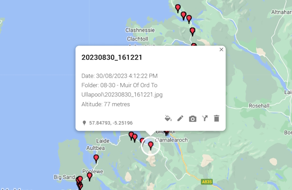

# Photo KML project

This console program is used to collect the EXIF Metadata from my mobile phone photos. I have turned on location so that I can collect Geo data from the photos.

The only input I need to set is the root directory of the photos I want to process. It will move recursively through all of the sub folders.

I then reformat the data into a KML file that I can open in Google maps.

The following image shows the information that I am collecting from the photos.



**Note:** this project use the NuGet package, MetaDataExtractor 2.8.1.

To install:

```bash
  Install-Package MetadataExtractor -Version 2.8.1
```

See Github for more details.

[Metadata Extractor source code on GitHub.](https://github.com/drewnoakes/metadata-extractor-dotnet)
